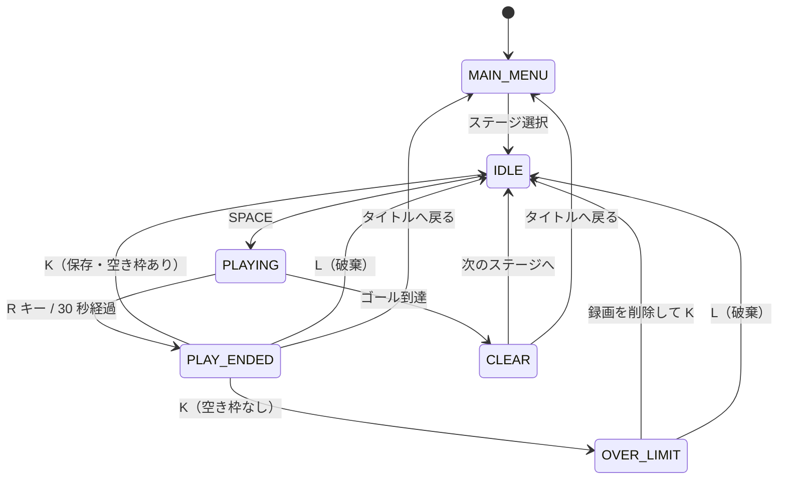

# Record ― ゲーム仕様書

本書は 2D パズルプラットフォーマー **Record** の全仕様を、**実際にゲームをプレイできない読者でも内容を完全に把握できる**ことを目的として記述したものである。README がプロジェクトの紹介と実装の要点をまとめたものであるのに対し、本書は「画面に何が表示され、どのキーで何が起き、内部で何が計算されるか」を網羅する。

記述はすべて実装（`record/` 以下のソース・シーン）を読み取った結果に基づく。数値は 2026-09-05 時点のリポジトリの値である。

---

## 目次

1. [ゲーム概要](#1-ゲーム概要)
2. [用語定義](#2-用語定義)
3. [システム構成](#3-システム構成)
4. [ゲーム状態機械（GameState）](#4-ゲーム状態機械gamestate)
5. [ゲームフロー詳細](#5-ゲームフロー詳細)
6. [入力仕様](#6-入力仕様)
7. [キャラクター物理仕様](#7-キャラクター物理仕様)
8. [録画・再生仕様](#8-録画再生仕様)
9. [ゴースト仕様](#9-ゴースト仕様)
10. [録画枠（メモリ）仕様](#10-録画枠メモリ仕様)
11. [ギミック仕様](#11-ギミック仕様)
12. [ステージ仕様](#12-ステージ仕様)
13. [UI 仕様](#13-ui-仕様)
14. [演出仕様](#14-演出仕様)
15. [チュートリアル仕様](#15-チュートリアル仕様)
16. [ワールドリセット仕様](#16-ワールドリセット仕様)
17. [データ構造リファレンス](#17-データ構造リファレンス)
18. [定数一覧](#18-定数一覧)
19. [仕様上の注意・既知の制約](#19-仕様上の注意既知の制約)

---

## 1. ゲーム概要

### 1.1 一言でいうと

**自分の過去のプレイを「録画」し、その再生映像（ゴースト）を足場やスイッチとして使って、一人では到達できない場所へ行く 2D パズルプラットフォーマー。**

### 1.2 プレイヤーが体験すること

プレイヤーは 1 体のキャラクターを操作する。ステージにはゴール（緑色の半透明の矩形エリア）があるが、**最初のプレイでは物理的にゴールへ到達できないように設計されている**。届かない高さの足場、閉じた扉、離れた位置のスイッチなどが行く手を阻む。

そこでプレイヤーは、1 回のプレイ（＝**ループ**、制限時間 30 秒）を「録画」する。ループが終わると「今のプレイを保存するか？」と問われ、保存すると、**次のループでは自分の過去の動きをそっくり再現する半透明のキャラクター（ゴースト）が、自分と同時に動き出す**。

ゴーストは実体を持つ。頭の上に乗って足場にできるし、床のスイッチを踏ませ続けることもできる。つまりプレイヤーは、

1. まず「スイッチを踏みに行くだけ」のプレイを録画し、
2. 次のループでそのゴーストにスイッチを踏ませておいて、開いた扉の先へ自分が進む

というように、**過去の自分と協力プレイをする**。

保存できる録画の本数はステージごとに決まっている（1〜3 本）。これが実質的な手数制限であり、パズルの難度を決めている。

### 1.3 ジャンル・規模

| 項目 | 内容 |
|---|---|
| ジャンル | 2D パズルプラットフォーマー |
| 視点 | 横スクロール（実際にはスクロールせず、1 画面固定） |
| プレイ人数 | 1 人 |
| ステージ数 | 4（Stage 1 = チュートリアル） |
| 1 ループの長さ | 30 秒 |
| エンジン | Godot 4.6（Forward+） |
| 言語 | GDScript |
| 解像度 | 1920 × 1080（ストレッチモード `canvas_items`） |
| セーブ機能 | なし（進行状況はアプリ終了で消える） |

### 1.4 画面の見た目

- 背景・地形は Brackeys' Platformer Bundle のドット絵タイルセット。
- プレイヤーキャラクターは **Godot のアイコン（青く着色）** で表示される。ゴーストも同じアイコンを、録画ごとに異なる色（赤・黄・緑・青…）で半透明（α = 0.6）に着色して表示する。※キャラクターアートは未実装で、プレースホルダとしてエンジンのアイコンを使っている。
- プレイ中は画面全体に**ビデオカメラのファインダー風の枠**（四隅の L 字マーク、中央の十字、点滅する「REC」表示、残り時間タイマー、録画残数を示すバッテリーアイコン）が重なる。「今この瞬間が録画されている」ことを視覚的に示すための演出。

---

## 2. 用語定義

| 用語 | 定義 |
|---|---|
| **ループ** | 1 回のプレイ試行。開始から最大 30 秒。ステージクリアまでに何回でも繰り返せる。 |
| **録画 / ゴーストデータ** | 1 ループ分のプレイヤー入力の記録（`GhostData`）。座標ではなく**入力そのもの**を保存する。 |
| **ゴースト** | 保存された録画を再生する半透明キャラクター。物理的な当たり判定を持つ。 |
| **録画枠 / メモリ** | 同時に保持できる録画の最大本数。ステージごとに 1〜3 本。 |
| **tick** | 物理フレーム 1 回分。1 秒 = 60 tick（Godot 既定の物理フレームレート）。 |
| **loop_tick** | 現ループ開始からの経過 tick。全ゴーストとプレイヤーが共有する唯一の時計。 |
| **ギミック** | スイッチ・扉・足場・梯子などのステージ仕掛けの総称。 |
| **IDLE** | ループ開始待ちの状態。盤面がリセットされ、`SPACE` 入力を待っている。 |

---

## 3. システム構成

### 3.1 全体構造

```
Main.tscn（ルート／常駐）
├── Level00X.tscn      … 選択中のステージ（実行時に差し替え）
│   ├── Terrain        … 地形タイルマップ
│   ├── SpawnPoint     … スポーン基準座標
│   ├── Goal           … クリア判定エリア
│   ├── 各種ギミック
│   ├── PlayerActor    … LoopManager が実行時に生成
│   └── GhostActor × n … LoopManager が実行時に生成
├── HUD                … ゲーム内 UI（常駐、状態で表示切替）
├── StageSelect        … タイトル兼ステージ選択（常駐、MAIN_MENU 時のみ表示）
└── RetryEffect        … ポストプロセス演出（常駐）
```

### 3.2 常駐マネージャ（Autoload）

4 つのシングルトンがゲーム全体を制御する。いずれもシーンツリーに常駐し、どこからでも参照できる。

| Autoload | 責務 |
|---|---|
| **GameManager** | 状態機械。状態遷移とシグナル発火のみを行い、ゲームロジックを持たない。 |
| **LoopManager** | ループの時計（`loop_tick`）、ゴーストの保持・生成・破棄、衝突レイヤーの割り当て、制限時間の判定。 |
| **RecordingManager** | プレイ中のプレイヤー入力を毎物理フレーム蓄積し、`GhostData` を生成する。 |
| **WorldResetManager** | ステージ内の全ギミックを初期状態へ戻す。 |

設計方針として、**GameManager はシグナルを発火するだけ**であり、HUD・演出・ゴースト管理・ギミックリセットはすべて「シグナルの購読側」として独立している。

### 3.3 GameManager が発火するシグナル一覧

| シグナル | 発火タイミング | 主な購読者 |
|---|---|---|
| `state_changed(new_state)` | 状態が変わるたび | HUD, LoopManager, WorldResetManager, StageSelect, バッテリー UI |
| `loop_started(loop_index)` | ループ開始（SPACE 押下） | LoopManager（時計始動）, RecordingManager（録画開始）, PlayerController |
| `play_ended(reached_goal)` | ループ終了（未クリア） | RecordingManager（録画停止） |
| `ghost_saved()` | 録画を保存した | HUD, バッテリー UI, RetryEffect（ノイズ演出） |
| `ghost_discarded()` | 録画を破棄した | HUD, バッテリー UI, RetryEffect（ホワイトアウト演出） |
| `over_limit()` | 空き枠がないのに保存しようとした | HUD, バッテリー UI, RetryEffect（MEMORY FULL 表示） |
| `room_retried()` | 部屋ごとやり直し | LoopManager, WorldResetManager, Main, HUD |
| `cleared()` | ゴール到達 | Main（Stage 1 ならステージ解放）, RecordingManager |
| `tutorial_hint(label)` | チュートリアル看板を通過 | CameraFrame（操作説明を追加） |
| `stages_unlocked()` | 全ステージ解放 | StageSelect, CameraFrame |
| `rewind_started()` | 初回保存の巻き戻し演出開始 | RetryEffect（長尺ノイズ）, HUD |
| `next_stage_requested()` | 「次のステージへ」押下 | Main |
| `return_to_title_requested()` | 「タイトルへ戻る」押下 | Main, LoopManager, HUD |

---

## 4. ゲーム状態機械（GameState）

ゲームは常に以下 7 状態のいずれかにある。

| 状態 | 意味 | 画面に表示されるもの | 受け付ける入力 |
|---|---|---|---|
| `MAIN_MENU` | タイトル兼ステージ選択 | 「RECORD」タイトルとステージボタン | ステージボタンのクリック |
| `IDLE` | ループ開始待ち | 「Press "SPACE" to Start」 | `SPACE` |
| `PLAYING` | 録画中・ゴースト再生中 | カメラフレーム UI（REC・タイマー・バッテリー） | 移動・ジャンプ・梯子・`R` |
| `PLAY_ENDED` | 保存 / 破棄の選択中 | 「Save the play?」＋ Yes/No ＋ 録画スロット一覧 | `K`（保存）、`L`（破棄）、各ボタン |
| `OVER_LIMIT` | 空き枠がないのに保存しようとした | 同上 ＋「MEMORY FULL」表示 | 同上 ＋ 既存録画の削除（×ボタン） |
| `CLEAR` | ゴール到達 | 「CLEAR!」＋「次のステージへ」「タイトルへ戻る」 | 各ボタン |
| `ROOM_RETRY` | 部屋ごとやり直し（ゴースト全消去） | 一瞬で `IDLE` へ抜ける | ― |

### 4.1 状態遷移図



### 4.2 状態遷移に伴う副作用

`IDLE` に入った瞬間に、以下が**必ず**まとめて起こる。

1. 既存のプレイヤー・ゴーストのインスタンスをすべて破棄する
2. ステージ内の全ギミックの `reset_state()` を呼び、盤面を初期状態へ戻す
3. 保持している録画の本数分のゴーストと、プレイヤー 1 体を再生成・再配置する
4. `loop_tick` を 0 に戻し、時計を停止状態にする

**設計意図**：リセットを「`SPACE` を押した瞬間」ではなく「`IDLE` に入った瞬間」に走らせることで、保存／破棄／削除を選んだその場で盤面が初期状態に戻る様子が見える。`SPACE` を押してから盤面が動く違和感を避けている。

---

## 5. ゲームフロー詳細

### 5.1 起動からクリアまで

```
アプリ起動
  ↓
タイトル画面（MAIN_MENU）
  「RECORD」＋ ステージボタン
  初回は Stage 1 のみ表示。Stage 1 をクリアすると Stage 1〜4 すべてが表示される
  ↓ ステージをクリック
ステージ読み込み → IDLE
  ↓ SPACE
┌─ ループ開始（PLAYING）────────────────────────┐
│  ・loop_tick が 0 から 1 ずつ増える            │
│  ・プレイヤーの入力が毎 tick 記録される        │
│  ・保存済みゴーストが同じ時計で一斉に再生される │
│  ・残り時間が画面右上に 0.1 秒単位で表示される  │
└───────────────────────────────────────────────┘
  ↓ 以下のいずれかで終了
  (a) R キーを押す              → PLAY_ENDED
  (b) 30 秒経過（1800 tick）    → PLAY_ENDED
  (c) ゴールに触れる            → CLEAR
  ↓ (a)(b) の場合
保存 / 破棄の選択（PLAY_ENDED）
  「Save the play?」  Yes("K") / No("L")
  画面下部にステージの録画枠が並ぶ（保存済み＝色付きフィルムアイコン、空き＝点線枠）
  ↓
  ├─ Yes ＆ 空き枠あり → 録画を保存 → ノイズ演出 → IDLE（次ループへ）
  │                       ※そのゲーム起動後の初回保存時のみ、巻き戻し演出（後述）
  ├─ Yes ＆ 空き枠なし → OVER_LIMIT（「MEMORY FULL」表示）
  │                       ×ボタンで既存録画を削除 → 再度 Yes で保存可能
  └─ No               → 録画を破棄 → ホワイトアウト演出 → IDLE（枠は消費しない）
  ↓ (c) の場合
クリア（CLEAR）
  「CLEAR!」＋「次のステージへ」「タイトルへ戻る」
```

### 5.2 ループ終了条件の詳細

| 終了条件 | 判定箇所 | 遷移先 | 録画の扱い |
|---|---|---|---|
| `R` キー押下 | `PlayerController._physics_process`（`PLAYING` 中のみ） | `PLAY_ENDED` | その時点までのフレームが保存候補として残る |
| 制限時間切れ | `LoopManager._physics_process`（`loop_tick >= max_tick`） | `PLAY_ENDED` | 1800 フレーム全部が保存候補として残る |
| ゴール到達 | `Goal`（Area2D）の `body_entered` | `CLEAR` | 保存の選択肢は出ない |

**重要**：`R` は途中終了であって「やり直し」ではない。押した時点までの短い録画が保存候補になる。「スイッチを踏んで、そこで止まる」ような短いゴーストを意図的に作るために使う。

### 5.3 ゴール判定

ゴールは `Area2D`（`collision_mask = 2` = プレイヤーのレイヤーのみ）である。したがって、

- **プレイヤーがゴールに触れた場合のみクリアになる。**
- **ゴーストがゴールに触れても何も起こらない。**（過去の自分にゴールさせても意味がない）

ゴール判定は `Main._load_level_by_index()` で、ステージ直下の `Goal` という名前の `Area2D` の `body_entered` シグナルに接続される。

### 5.4 ステージ解放

- 起動直後はステージ選択に **Stage 1 しか表示されない**。
- **Stage 1 をクリアした時点で全ステージが解放**され、以降は Stage 1〜4 すべてが選択可能になる（`GameManager.unlock_all_stages()`）。
- 解放状態はメモリ上のみで保持され、**アプリを再起動するとリセットされる**（セーブ機能なし）。
- ステージ選択画面のボタンは `scenes/levels/` を実行時に走査して自動生成される。`Level005.tscn` を置けばコード変更なしで項目が増える。

---

## 6. 入力仕様

### 6.1 キーバインド

| アクション名 | キー | 有効な状態 | 動作 |
|---|---|---|---|
| `move_left` | `A` / `←` | PLAYING | 左移動 |
| `move_right` | `D` / `→` | PLAYING | 右移動 |
| `jump` | `SPACE` | IDLE | ループ開始 |
| `jump` | `SPACE` | PLAYING | ジャンプ（接地時のみ） |
| `move_up` | `W` | PLAYING | 梯子を登る |
| `move_down` | `S` | PLAYING | 梯子を降りる |
| `retry` | `R` | PLAYING | ループを途中終了して保存/破棄選択へ |
| `save_ghost` | `K` | PLAY_ENDED / OVER_LIMIT | 直前のループを録画として保存 |
| `discard_ghost` | `L` | PLAY_ENDED / OVER_LIMIT | 直前のループを破棄 |
| `interact` | `E` | ―（記録はされるが未使用） | 将来のギミック用に予約 |

すべてのキーは `deadzone = 0.2` の `InputEventKey` として `project.godot` に定義されている。ゲームパッドのバインドは未設定。

### 6.2 マウス操作

キーボードだけで完結するが、以下は HUD ボタンのクリックでも行える。

- 「Yes ("K")」／「No ("L")」ボタン（保存／破棄）
- 録画スロット右上の「×」ボタン（その録画を削除）
- 「‹ Return to Title」ボタン
- 「次のステージへ」「タイトルへ戻る」ボタン
- ステージ選択画面の「Stage N」ボタン

### 6.3 入力ロック

`GameManager.input_locked` が `true` の間、プレイヤーの操作・録画・各キー判定はすべて無効になる。これは**初回保存時の巻き戻し演出（3 秒間）**の最中にのみ立てられ、演出中の誤操作を防ぐ。

---

## 7. キャラクター物理仕様

プレイヤーとゴーストは共通の基底クラス `ActorBase`（`CharacterBody2D`）を継承しており、**物理挙動は完全に同一**である。両者の違いは「入力をどこから取るか」（`_get_input()` のオーバーライド）だけ。

### 7.1 移動パラメータ

パラメータは `MovementStats` リソース（`record/src/data/player_movement.tres`）に格納され、プレイヤーとゴーストで**同じファイルを共有**する。したがって録画時と再生時で挙動がずれることが原理的に起きない。

| パラメータ | 値 | 単位 | 意味 |
|---|---|---|---|
| `move_speed` | **450** | px/s | 横方向の最高速度 |
| `jump_velocity` | **-700** | px/s | ジャンプ時に与える上向き初速（負が上） |
| `gravity` | **1700** | px/s² | 落下加速度 |
| `climb_speed` | **200** | px/s | 梯子の昇降速度 |
| `accel` | **2400** | px/s² | 横方向の加減速度 |

> `.tres` で明示的に上書きされているのは `move_speed`（450）と `gravity`（1700）。他の 3 つは `MovementStats.gd` の既定値がそのまま使われる。

### 7.2 挙動の詳細

**通常時（地上・空中）**

1. 接地していなければ `velocity.y += gravity * delta`（重力）
2. `jump` が押された瞬間かつ接地中なら `velocity.y = jump_velocity`
3. 横方向は `move_toward(velocity.x, 入力方向 * move_speed, accel * delta)` で目標速度へ滑らかに寄せる（急停止・急発進しない）
4. `move_and_slide()` で移動を実行

**梯子に触れている間**

1. **重力を完全に無視する**
2. `W` で上へ `climb_speed`、`S` で下へ `climb_speed`、どちらも押していなければ `velocity.y = 0`（空中静止）
3. 横方向は入力に応じて即座に `move_speed`（加減速なし）
4. **梯子中はジャンプできない**

**接地判定**：`is_on_floor()`（Godot 標準）を使用。加えて各アクターは `FloorDetector`（`ShapeCast2D`）を持ち、これはゴーストごとに衝突マスクを揃えるために存在する。

### 7.3 足場としてのゴーストへの追従

ゴーストの頭の上に乗って一緒に移動する処理は、**自前で速度を合成していない**。`move_and_slide()` のムービングプラットフォーム機能（Godot 標準）に任せている。

これにより `velocity` は常に「足場に対する相対速度」だけを表せばよく、横移動中のゴーストの上でも、ジャンプ中のゴーストの上でも、特別扱いなしで正しく追従する。

### 7.4 物理の停止

`ActorBase._physics_process()` は **`GameState` が `PLAYING` でない限り即座に return する**。したがって、

- `IDLE` 中はプレイヤーもゴーストも完全に静止する（重力すらかからない）
- スポーン位置が空中であっても、`SPACE` を押すまで落下しない

### 7.5 当たり判定サイズ

| アクター | 矩形サイズ | 備考 |
|---|---|---|
| PlayerActor | 128 × 127 px | 中心から (0, -0.5) オフセット |
| GhostActor | 127 × 126 px | 中心から (-0.5, 0) オフセット |

---

## 8. 録画・再生仕様

このゲームの技術的な中核。

### 8.1 録画されるもの＝入力

録画の実体は**プレイヤーの座標ではなく、入力そのもの**である。1 物理フレームにつき 1 個の `InputFrame` が記録される。

```gdscript
class InputFrame:
    tick      : int    # そのフレームの loop_tick
    move_dir  : float  # -1.0 〜 1.0（左右入力の軸値）
    jump      : bool   # そのフレームでジャンプが押された瞬間か
    interact  : bool   # E キーが押されているか（現状未使用）
    move_up   : bool   # W キーが押されているか
    move_down : bool   # S キーが押されているか
```

`PlayerController._physics_process()` が `PLAYING` 中、毎フレーム `RecordingManager.record_frame()` を呼んで配列に追加する。30 秒フルに走ると 1800 個の `InputFrame` が溜まる。

**座標ではなく入力を保存する利点**：再生時も同じ物理演算を通るため、その場の地形やギミックの状態変化（例：足場が消えた）に対しても物理的に整合した結果になる。逆に言えば、**再生は物理シミュレーションの再実行であり、記録された軌跡の再描画ではない**。

### 8.2 共通クロック方式

再生側の `GhostController` は**自分の経過時間を一切持たない**。`LoopManager.loop_tick` という単一のカウンタでフレームを索引する。

```gdscript
func _get_input() -> Dictionary:
    var frame := _ghost_data.get_frame(LoopManager.loop_tick)
    return { move_dir = frame.move_dir, jump = frame.jump, ... }
```

`loop_tick` は `LoopManager._physics_process()` で毎フレーム +1 される。全ゴーストとプレイヤーがこの 1 個の時計を共有するため、**ループを何度またいでも再生タイミングがずれない**。

制限時間も秒ではなく tick で判定する：

```
max_tick = time_limit_sec × Engine.physics_ticks_per_second
         = 30.0 × 60
         = 1800 tick
```

`loop_tick >= max_tick` になった瞬間に時計を止め、`GameManager.end_play(false)` を呼ぶ。

### 8.3 録画より短い／長い場合

`GhostData.get_frame(tick)` は、`tick` が記録範囲外（負、または記録フレーム数以上）の場合、**すべての値が初期値（無入力）の空フレーム**を返す。

したがって、

- `R` キーで 5 秒で終了した録画は、次のループでは **5 秒間動いたあと、その場で入力なしになる**（重力は効き続けるので落下はする）。
- これがパズルの基本テクニックになる。「スイッチの上まで歩いて、そこで `R` を押す」→ そのゴーストは以降ずっとスイッチの上に立ち続ける。

### 8.4 録画の確定タイミング

| イベント | RecordingManager の動作 |
|---|---|
| `loop_started` | `_frames` をクリアして記録開始 |
| `play_ended` | 記録停止（`_frames` の内容は保持される） |
| `cleared` | 記録停止 |
| 保存が押された | `build_ghost_data()` で `_frames` を複製した `GhostData` を生成 |

`_frames` は次のループ開始まで保持されるため、`OVER_LIMIT` 状態で既存録画を削除してから改めて保存する、という操作が成立する。

---

## 9. ゴースト仕様

### 9.1 見た目

- プレイヤーと同じスプライト（Godot アイコン）。
- 録画のインデックスに応じた色で、**α = 0.6 の半透明**に着色される。

| インデックス | 色 |
|---|---|
| 0 | 赤 `(1.0, 0.2, 0.2)` |
| 1 | 黄 `(1.0, 1.0, 0.0)` |
| 2 | 緑 `(0.2, 1.0, 0.2)` |
| 3 | 青 `(0.2, 0.5, 1.0)` |
| 4 | 紫 `(0.8, 0.2, 1.0)` |
| 5 | 白 `(1.0, 1.0, 1.0)` |
| 6 | 黒 `(0.2, 0.2, 0.2)` |

（7 色を巡回する。実際には最大 3 本なので赤・黄・緑まで使われる。HUD の録画スロットのフィルムアイコンも同じ色で表示される。）

### 9.2 スポーン位置

ステージ内の `SpawnPoint`（`Marker2D`）の座標を基準に、**64 px ずつ右へずらして並べる**。

```
ゴースト i の位置   = SpawnPoint + (i × 64, 0)
プレイヤーの位置    = SpawnPoint + (保存済み録画数 × 64, 0)
```

つまりループを重ねるごとに、プレイヤーの初期位置はわずかに右へずれる。これは、同じ位置にスポーンしたキャラ同士がめり込むのを避けるための措置である。

> **副作用**：スタート位置が毎ループ 64 px ずつ変わるため、録画したときとまったく同じ入力でも、次ループのプレイヤー本人の到達位置は 64 px ずれる。プレイヤーはこのずれを織り込んで操作する必要がある。

### 9.3 衝突関係 ― 一方向の当たり判定

ゴーストの上に乗れるようにしつつ、**ゴーストが後発のプレイヤーに押されて軌道が変わることを防ぐ**必要がある。押されて軌道が変われば、再生が破綻してパズルが成立しなくなるからである。

そこで `LoopManager` はスポーン時に衝突レイヤーを**動的に**割り当て、次の一方向の関係を作る。

**レイヤー定義**

| ビット | レイヤー | 用途 |
|---|---|---|
| bit 0 (=1) | World | 地形・扉・足場 |
| bit 1 (=2) | Player | プレイヤー |
| bit 2 (=4) | Ghost_0 | 1 本目のゴースト |
| bit 3 (=8) | Ghost_1 | 2 本目のゴースト |
| bit 4 (=16) | Ghost_2 | 3 本目のゴースト |
| bit 5 (=32) | Ghost_3 | 4 本目のゴースト |

**割り当てルール**

| アクター | 所属レイヤー | 衝突マスク（何とぶつかるか） |
|---|---|---|
| プレイヤー | Player | World ＋ **全ゴースト**（= 61） |
| ゴースト 0 | Ghost_0 | World のみ（= 1） |
| ゴースト 1 | Ghost_1 | World ＋ Ghost_0（= 5） |
| ゴースト 2 | Ghost_2 | World ＋ Ghost_0 ＋ Ghost_1（= 13） |
| ゴースト N | Ghost_N | World ＋ Ghost_0 … Ghost_{N-1} |

これにより次が保証される。

- **プレイヤーは全ゴーストの上に乗れる。**
- **ゴーストのマスクにはプレイヤーのビットが入らないため、ゴーストは後から走るプレイヤーに押されない。**
- **ゴーストは自分より古いゴーストの上に乗れる。**（録画時にそう動いていたなら、再生時も同じように乗れる）
- ゴーストは自分より新しいゴーストとはすり抜ける。

`FloorDetector`（`ShapeCast2D`）にも同じマスクが設定される（`ActorBase._ready()` より後に上書きされる）。

---

## 10. 録画枠（メモリ）仕様

### 10.1 ステージごとの上限

保存できる録画の本数は `Level.gd` の `max_ghosts` としてステージシーンのインスペクタから設定する。

| ステージ | `max_ghosts` |
|---|---|
| Stage 1 | **3**（既定値。シーンで明示指定なし） |
| Stage 2 | **2** |
| Stage 3 | **2** |
| Stage 4 | **1** |

これが実質的な手数制限であり、パズルの難度を決めている。

### 10.2 保存の判定ロジック

保存は `LoopManager.save_recording()` に集約されている。判定は**「追加する前に空き枠があるか」**で行う。

```
if 保存済み本数 >= max_ghosts:
    → 保存できない。OVER_LIMIT へ遷移し「MEMORY FULL」を表示する
else:
    → 保存する
      ├─ そのゲーム起動後、初回の保存なら → 巻き戻し演出（3 秒）→ IDLE
      └─ 2 回目以降なら                  → ノイズ演出 → IDLE
```

**最後の 1 枠を埋める保存は正常扱い**である。上限 3 のステージで 3 本目を保存するのは成功し、4 本目を保存しようとした時に初めて `MEMORY FULL` になる。

### 10.3 破棄

`L` キーまたは「No」ボタンで破棄した場合、**枠は一切消費されない**。ホワイトアウト演出のあと `IDLE` に戻り、同じ盤面で再挑戦できる。失敗したループを気軽に捨てられる設計。

### 10.4 削除

`PLAY_ENDED` / `OVER_LIMIT` のパネルには、保存済み録画がフィルムアイコンとして並んでいる。各アイコンの右上の「×」ボタンで、その録画を削除できる。

- 削除しても**ゲーム状態は変わらない**（パネルは開いたまま）。したがって、`MEMORY FULL` になったあとに古い録画を削除して、そのまま「Yes」を押し直すという操作が成立する。
- 削除するとインデックスは詰め直される（ゴースト 0 を消せば、元のゴースト 1 が新しいゴースト 0 になる）。**色も付け直される**ので、削除後は残った録画の色が変わる。
- 削除は即座に反映され、次の `IDLE` 遷移時に該当ゴーストがスポーンしなくなる。

### 10.5 「Yes」ボタンの無効化

空き枠がないとき（`is_at_limit`）、「Yes ("K")」ボタンは `disabled` になり、押せなくなる。ただし**キーボードの `K` は依然として受け付けられ**、押すと `MEMORY FULL` 演出が出る。

---

## 11. ギミック仕様

### 11.1 ギミックの共通契約

ギミックは共通の基底クラスやインターフェースを継承しない。**決まった名前のメソッドを実装しているかどうか**（ダックタイピング）で接続される。

| メソッド | 呼ばれるタイミング | 呼び出し元 |
|---|---|---|
| `reset_state()` | `IDLE` 遷移時・部屋やり直し時 | `WorldResetManager` がステージ以下を再帰走査して呼ぶ |
| `activate()` | トリガーが ON になったとき | `PressurePlate` が `has_method()` 経由で呼ぶ |
| `deactivate()` | トリガーが OFF になったとき | 同上 |

不要なメソッドは実装しなくてよい。新しいギミックは、これらのメソッドを必要な分だけ書いてステージに配置すれば組み込める。

### 11.2 PressurePlate（圧力板／スイッチ）

- **形状**：64 × 8 px の薄い板。既定色は茶色 `(0.5, 0.4, 0.2)`。
- **検出対象**：`collision_mask = 62`（= プレイヤー ＋ 全ゴースト）。**プレイヤーもゴーストも踏める。**
- **動作**：モーメンタリ（**踏んでいる間だけ ON**）。
  - 何かが乗った瞬間（重なり数 0 → 1）に ON となり、`target_paths` に指定した全ターゲットの `activate()` を呼ぶ。
  - 乗っているものが全部いなくなった瞬間に OFF となり、全ターゲットの `deactivate()` を呼ぶ。
  - 複数のものが同時に乗っても、1 個でも残っていれば ON のまま（重なり数で管理）。
- **見た目のフィードバック**：ON になると 0.07 秒で 6 px 沈み込み、色が暗く `(0.3, 0.25, 0.1)` へ変化する。OFF で元に戻る。
- **シグナル**：`plate_pressed` / `plate_released` も発火する（現行ステージでは未使用）。
- **リセット**：重なりリストをクリアし、見た目を初期位置・初期色へ戻す。

**パズル上の役割**：ゴーストに踏ませ続けることで、プレイヤーが自由に動ける。「モーメンタリ（踏み続けが必要）」であることが、このゲームの中心的な制約になっている。

### 11.3 Door（扉）

- **形状**：16 × 128 px の縦長の壁。色は茶色 `(0.4, 0.2, 0.1)`。
- **物理**：`AnimatableBody2D`、**World レイヤー**（bit 0）に所属。したがってプレイヤーもゴーストも通れない壁として機能する。
- **動作**：
  - `activate()` → **開く**（当たり判定を無効化し、非表示になる）
  - `deactivate()` → **閉じる**（当たり判定を有効化し、表示される）
- **初期状態**：`starts_open`（既定 `false` ＝閉じている）。`reset_state()` でこの値に戻る。

### 11.4 Platform（出現する足場）

- **形状**：32 × 10 px の横長の板。
- **物理**：`AnimatableBody2D`、World レイヤー所属。`collision_mask = 0`（自分からは何とも当たらない ＝ 静的な足場として振る舞う）。
- **動作**：
  - `activate()` → **出現**（当たり判定有効＋表示）
  - `deactivate()` → **消滅**（当たり判定無効＋非表示）
- **初期状態**：`initial_state`（既定 `false` ＝消えている）。

**パズル上の役割**：ゴーストがスイッチを踏んでいる間だけ足場が出現する。プレイヤーはその足場の上にいる間、ゴーストがスイッチから離れないことを祈る（＝録画の設計が重要になる）。

### 11.5 Lamp（ランプ）

- **形状**：`ColorRect`。消灯時は暗いグレー `(0.15, 0.15, 0.15)`、点灯時は黄色 `(1.0, 0.9, 0.2)`。
- **動作**：`activate()` / `deactivate()` で 0.15 秒かけて色が変化する。
- **当たり判定を持たない、純粋な視覚的フィードバック**。「今スイッチが押されている」ことを離れた場所からでも確認できるようにするためのもの。

### 11.6 Ladder（梯子）

- **形状**：14 × 32 px の `Area2D`（複数個を縦に並べて長い梯子を作る）。
- **検出対象**：`collision_mask = 62`（プレイヤー ＋ 全ゴースト）。
- **動作**：エリアに入ったアクターの `_ladder_count` を +1、出たら −1 する。`_ladder_count > 0` の間、そのアクターは梯子状態になる（重力無効・`W`/`S` で昇降）。
- **カウンタ方式の理由**：梯子を複数個重ねて配置しても、境界をまたぐときに一瞬「どの梯子にも属していない」状態が生じて落下する、といった不具合を防ぐため。

### 11.7 Goal（ゴール）

- **形状**：100 × 100 px の `Area2D`。緑の半透明 `(0.2, 1.0, 0.4, 0.5)` の矩形として表示される（ステージによって横に引き伸ばして配置される）。
- **検出対象**：`collision_mask = 2` ＝ **プレイヤーのみ**。ゴーストは反応しない。
- **動作**：プレイヤーが触れると即座に `CLEAR` 状態へ遷移する。

### 11.8 Tutorial（チュートリアル看板）

- **形状**：164 × 160 px の `Area2D` ＋ 看板スプライト。
- **検出対象**：`collision_mask = 2` ＝ **プレイヤーのみ**。
- **動作**：
  - プレイヤーが範囲に入ると、看板の上に吹き出しが `TRANS_BACK` イージングで 0.18 秒かけてポップアップする（`hint_text` の文章を表示）。
  - 同時に `GameManager.tutorial_hint(control_label)` を発火し、画面上部の操作説明に項目を 1 つ追加する。
  - 範囲を出ると吹き出しが 0.12 秒で縮んで消える。

### 11.9 Pulley（滑車）

ロープで繋がれた 2 つのカゴ（`BasketA` / `BasketB`）が、常に**逆方向へ同じ距離だけ**動くギミック。カウンターウェイト式で、`activate()` / `deactivate()` は持たない（トリガーからは操作されない）。

- **形状**：カゴは 160 × 24 px の板（`ColorRect`、茶色 `(0.55, 0.4, 0.22)`）。既定では中心から左右 220 px の位置に置かれ、滑車（`Wheel`、`Marker2D`）は 300 px 上にある。滑車の円とロープは親ノードの `_draw()` で描かれるため、常にカゴの背面に回る。
- **物理**：カゴは `AnimatableBody2D`、**World レイヤー**（bit 0）、`collision_mask = 0`。`sync_to_physics` が有効なので、上に乗ったアクターは `move_and_slide()` のムービングプラットフォーム機能で運ばれる（追従の自前実装は不要）。
- **重さの検出**：各カゴの上面に薄い `WeightArea`（`Area2D`、150 × 40 px、カゴ中心から 32 px 上）を持ち、`collision_mask = 62`（プレイヤー ＋ 全ゴースト）。**プレイヤーもゴーストも等しく 1 人分の重り**として数える。
- **動作**：毎物理フレーム、`A に乗っている数 − B に乗っている数` の**符号だけ**を見て動かす。
  - 差が正 → A が下降・B が上昇
  - 差が負 → B が下降・A が上昇
  - **差が 0 → その場で静止**（初期位置へは戻らない）
- **速度**：`move_speed`（既定 150 px/s）。人数差の**大きさによらず一定**。プレイヤーの移動速度（450 px/s）より遅く、動きを目で追えるようにしてある。
- **可動範囲**：`move_range`（既定 260 px・片側）。初期位置から上下それぞれこの距離でクランプされる。
- **`PLAYING` 中のみ動く**：`ActorBase` と同じ状態ガードを持つ。アクターが停止している `PLAY_ENDED` などでカゴだけが動くと、乗っているアクターが置き去りになるため。
- **リセット**：`reset_state()` で乗員リストをクリアし、オフセットを 0 に戻して両カゴを初期位置へ戻す。
- **配置上の注意**：`move_range` / `move_speed` はこのノードのローカル単位のため、Pulley 自体を拡大縮小すると見かけの距離と速度も比例して変わる。他のギミックと違い**実寸で作られている**ので、レベルには `scale = 1` で配置する。

**パズル上の役割**：ゴーストを片方のカゴに乗せた録画を取り、次のループで上がってきたもう片方のカゴに自分が乗る。「静止する」仕様のため、ゴーストが降りた後もカゴは上がった位置に残り、1 本の録画で高所への足場を作れる。

> **既知の性質**：`WeightArea` はカゴの上を通過するアクターも一瞬「重り」として数える（`PressurePlate` と同じ性質）。飛び越えただけで滑車がわずかに動くことがある。

---

## 12. ステージ仕様

> 座標はステージシーン内のローカル座標（px）。Y は下方向が正。地形の詳細形状はタイルマップデータのため、以下ではギミックの配置と論理構造を記述する。想定解は配置とギミックの接続から読み取ったものであり、他の解法もあり得る。

### 12.1 Stage 1（Level001）― チュートリアル

| 項目 | 値 |
|---|---|
| 録画枠 | **3** |
| ギミック | なし（チュートリアル看板 4 枚のみ） |
| スポーン | (178, 273) |
| ゴール | (1530, −27)、横に 7.64 倍に引き伸ばされた帯状 |

**構成**：床の上に 4 枚のチュートリアル看板が左から順に並ぶ。

| 位置 | 吹き出しの文言 | 操作説明への追加 |
|---|---|---|
| (311, 480) | `Press "WASD" to Move` | `WASD: Move` |
| (640, 480) | `Press "SPACE" to Jump` | `SPACE: Jump` |
| (985, 481) | `Reach the GREEN zone !` | （なし） |
| (1589, 482) | `Press "R" to Retry, and then...` | `R: Retry` |

**狙い**：移動 → ジャンプ → ゴールの存在 → リトライ、という順に操作を教える。ゴールは天井付近（y = −27）に横長に配置されており、**1 回のジャンプでは届かない**。プレイヤーは「`R` を押して録画を保存し、そのゴーストの頭に乗って高い場所へ上がる」という、このゲームの根幹の操作を、ここで初めて自力で発見することになる。

このステージをクリアすると全ステージが解放される。また、ここでの初回保存時に**巻き戻し演出**が 1 度だけ再生され、「時間が巻き戻り、録画だけが残る」というルールが視覚的に提示される。

### 12.2 Stage 2（Level002）― スイッチと扉

| 項目 | 値 |
|---|---|
| 録画枠 | **2** |
| スポーン | (221, 675) |
| ゴール | (1863, 686) ― 画面右端 |

**ギミック配置**

| ギミック | 位置 | 接続 |
|---|---|---|
| PressurePlate | (664, 863) | → Door, Lamp |
| Door | (1497, 791) | 閉じた状態で開始（`starts_open = false`） |
| Lamp | (1468, 716) | 扉の真上に配置 |

**構造**：スポーン地点（左）とゴール（右）の間に閉じた扉が立ちはだかる。扉を開く唯一のスイッチは、扉よりずっと手前（左、x = 664）の低い位置にある。スイッチはモーメンタリなので、**自分でスイッチを踏んでも、離れて扉へ向かった瞬間に扉が閉じる。**

**想定解**：
1. 1 ループ目でスイッチの上まで歩き、その上で `R` を押して終了する。この録画を保存する。
2. 2 ループ目では、そのゴーストがスイッチの上まで歩いて立ち止まり、以降ずっと踏み続ける（録画終了後は無入力なので、その場に立ち続ける）。扉が開き、ランプが点灯する。
3. その間にプレイヤーは右へ走り、開いた扉を通ってゴールへ到達する。

録画枠 2 に対して 1 本で解けるため、余裕を持って「スイッチを踏む役」の概念を学べる導入ステージになっている。

### 12.3 Stage 3（Level003）― スイッチの連鎖

| 項目 | 値 |
|---|---|
| 録画枠 | **2** |
| スポーン | (634, 760) |
| ゴール | (1866, 520) ― 右上 |

**ギミック配置**

| ギミック | 位置 | 接続 |
|---|---|---|
| PressurePlate | (995, 862) | → Platform1-1, Platform1-2, Lamp |
| PressurePlate2 | (95, 610) | → Platform2 |
| Platform1-1 | (367, 780) | 初期状態：消えている |
| Platform1-2 | (1361, 780) | 初期状態：消えている |
| Platform2 | (1620, 693) | 初期状態：消えている |
| Lamp | (269, 786) | ― |

**構造**：2 つのスイッチが**連鎖**している。

- スイッチ 1（中央下、x = 995）を踏むと、左（x = 367）と右（x = 1361）に足場が出る。
- スイッチ 2（左上、x = 95, y = 610 ＝高い位置）を踏むと、ゴール手前（x = 1620）に足場が出る。
- **スイッチ 2 のある高所には、スイッチ 1 が出す左の足場（Platform1-1）を経由しないと登れない。**

**想定解**（録画枠 2 をちょうど使い切る）：
1. 1 ループ目：スイッチ 1（中央下）まで移動して `R`。→ 保存。このゴーストは以降ずっとスイッチ 1 を踏み続け、左右の足場を出しっぱなしにする。
2. 2 ループ目：出ている左の足場を伝って高所へ登り、スイッチ 2 まで移動して `R`。→ 保存。このゴーストは以降ずっとスイッチ 2 を踏み続け、ゴール手前の足場を出しっぱなしにする。
3. 3 ループ目：2 体のゴーストが両方のスイッチを踏んでいる状態で、プレイヤーは右の足場（Platform1-2）とゴール手前の足場（Platform2）を伝ってゴールへ到達する。

ランプ（左、x = 269）はスイッチ 1 の状態を示す。

### 12.4 Stage 4（Level004）― 1 本の録画で 2 つのスイッチ

| 項目 | 値 |
|---|---|
| 録画枠 | **1**（最難関） |
| スポーン | (526, 774) |
| ゴール | (1862, 264) ― 右上の高所 |

**ギミック配置**

| ギミック | 位置 | 接続 |
|---|---|---|
| PressurePlate | (994, 862) | → Platform1-1, Platform1-2 |
| PressurePlate2 | (1317, 862) | → Platform2-1, Platform2-2 |
| Platform1-1 | (472, 360) | 初期状態：消えている |
| Platform2-1 | (801, 360) | 初期状態：消えている |
| Platform1-2 | (1130, 358) | 初期状態：消えている |
| Platform2-2 | (1462, 360) | 初期状態：消えている |
| Ladder × 5 | x ≈ 225、y = 838 → 384 | 左端の縦の梯子 |

**構造**：ゴールは右上 (1862, 264) にあり、そこへ至る唯一の経路は **y ≈ 360 の高さに一列に並んだ 4 枚の足場**である。プレイヤーは左端の梯子（x ≈ 225）を登ってこの高さに到達し、足場を左から右へ渡っていく。

ところが、4 枚の足場は **2 つのスイッチに交互に割り当てられている**。

```
x座標:      472        801        1130       1462      → ゴール(1862)
足場:    Platform1-1 Platform2-1 Platform1-2 Platform2-2
必要な    スイッチ1   スイッチ2    スイッチ1   スイッチ2
スイッチ:  (994)      (1317)      (994)      (1317)
```

そして**録画枠は 1 本しかない**。つまり、1 体のゴーストで 2 つのスイッチを賄わなければならない。

**想定解**：スイッチは**モーメンタリ**（踏んでいる間だけ ON）である性質を逆手に取り、**2 つのスイッチの間を往復し続けるゴースト**を録画する。

1. 1 ループ目：スイッチ 1（x = 994）とスイッチ 2（x = 1317）の間を、30 秒間ひたすら往復する動きを録画して保存する。
2. 2 ループ目：ゴーストが往復するのに合わせて、プレイヤーは梯子を登り、**足場が出ている瞬間を狙って**足場から足場へ飛び移り、右上のゴールへ到達する。

このステージだけは「スイッチを踏んで止まる」静的なゴーストではなく、**タイミングを合わせる動的なゴースト**が要求される。ゴーストの往復周期とプレイヤーの移動を同期させる、リズムゲーム的な難所として設計されている。

---

## 13. UI 仕様

### 13.1 タイトル／ステージ選択画面（`MAIN_MENU`）

- 中央のパネルに **「RECORD」** のタイトル。
- その下に「Stage 1」「Stage 2」… のボタンが縦に並ぶ（フォントサイズ 40、最小サイズ 300 × 60）。
- ボタンは `scenes/levels/` 内の `LevelNNN.tscn` を実行時に走査し、ファイル名から番号を取り出して自動生成される。
- 未解放時は **Stage 1 のみ**表示。`GameManager.all_stages_unlocked` が true になると全件表示される。

### 13.2 プレイ中の HUD（`PLAYING`）― カメラフレーム UI

画面全体に、ビデオカメラのファインダーを模した枠が重なる。

| 要素 | 内容 |
|---|---|
| 四隅の L 字マーク | ファインダーの枠（TL/TR/BL/BR の縦横バー） |
| 中央の十字 | 照準マーク |
| **REC 表示** | 赤い丸 ＋「REC」の文字。α を 0.12 ↔ 0.5 の間で 1.2 秒周期にサインカーブで点滅させる |
| **タイマー** | 残り時間を `%.1f` 形式（例：`23.4`）で毎フレーム更新。初期表示は `30.0` |
| **バッテリーメーター** | 残り録画可能回数を電池残量として図示（詳細は 13.3） |
| **操作説明** | チュートリアルで習得した操作の一覧（詳細は 15 章） |

### 13.3 バッテリーメーター（録画残数）

残り録画可能回数（`max_ghosts − 保存済み本数`）を、電池アイコンとして描画する。

- 電池の枠（矩形）＋ 右端の端子（凸部）。
- 内部に、**残り回数と同じ数だけ平行四辺形のセグメント**を描く。セグメント数の分母は `max_ghosts`（＝そのステージの上限）なので、上限 3 のステージでは 3 目盛りの電池、上限 1 のステージでは 1 目盛りの電池になる。
- メーターに重ねて**残り回数の数字**を表示する（0 のときは数字を出さない）。
- 色は残量に応じて変わる：

| 残量 | 色 |
|---|---|
| 満タン（＝ `max_ghosts` と同じ） | 黄緑 `(0.55, 0.85, 0.2)` |
| 中間 | 黄 `(0.95, 0.8, 0.1)` |
| 残り 1 | 赤 `(0.9, 0.2, 0.15)` |
| 残り 0 | 枠が赤くなり、**内部に斜線が引かれる**（電池切れアイコン）。セグメントも数字も描かれない |

### 13.4 ループ開始待ち画面（`IDLE`）

- 画面に「**Press "SPACE" to Start**」（フォントサイズ 32）のパネルが表示される。
- 背後ではステージとキャラクターが静止した状態で表示されており、次のループの初期配置を確認できる。

### 13.5 保存／破棄パネル（`PLAY_ENDED` / `OVER_LIMIT`）

上から順に以下が並ぶ。

1. **「‹ Return to Title」** ボタン（フォントサイズ 34）― タイトルへ戻る
2. **「Save the play?」** の見出し（フォントサイズ 44）
3. **「Yes ("K")」／「No ("L")」** の 2 ボタン（フォントサイズ 44）
   - 空き枠がないとき「Yes」は無効化（グレーアウト）される
4. 区切り線
5. **録画スロット一覧**（横並び）
   - スロットは**常に `max_ghosts` 個ぶん**並ぶ（保存本数によらず枠の総数が見える）
   - **保存済みスロット**：そのゴーストの色に着色されたフィルム（動画再生）アイコン、右上に削除用の「×」ボタン、下に通し番号（1, 2, 3…）
   - **空きスロット**：点線の角丸四角（自前の `_draw()` による破線描画。ダッシュ 14 px / 隙間 10 px / 線幅 4 px / 角丸 16 px）
   - アイコンサイズは既定 140 × 104 px

### 13.6 クリア画面（`CLEAR`）

- 「**CLEAR!**」（フォントサイズ 64）
- 「**次のステージへ**」ボタン ― 次の番号のステージを読み込む。存在しなければタイトルへ戻る。
- 「**タイトルへ戻る**」ボタン

---

## 14. 演出仕様

状態遷移の種類ごとに**異なるポストプロセス演出**を割り当てることで、**文字を読まなくても何が起きたかが区別できる**ようにしている。すべて `RetryEffect` ノードが `GameManager` のシグナルを購読して再生する。

| 出来事 | 演出 | 内容 |
|---|---|---|
| **保存**（通常） | ノイズ（短） | 画面全体に走査線・波打ちノイズのシェーダ。`intensity` を 1 → 0 へ **0.5 秒**で減衰 |
| **保存**（初回のみ） | ノイズ（長）＋ 巻き戻し | **3.0 秒**の長いノイズ ＋ プレイヤーの軌跡の逆再生。入力ロックあり |
| **破棄** | ホワイトアウト | 0.06 秒で一気に白 α = 0.9 まで飛ばし、0.4 秒でフェードアウト |
| **メモリ満杯** | テキスト＋画面振動 | 「**MEMORY FULL / Delete a ghost to continue**」を赤字（フォントサイズ 48）で表示。0.1 秒でフェードイン → 0.5 秒保持 → 0.3 秒でフェードアウト。同時に 0.25 秒間、8 px の範囲で画面をランダムに振動させる |

### 14.1 ノイズシェーダのパラメータ

| パラメータ | 値 |
|---|---|
| `wave_amplitude` | 0.02 |
| `wave_frequency` | 50.0 |
| `wave_speed` | 7.0 |
| `band_count` | 5.0 |
| `band_speed` | 0.29 |
| `band_width` | 0.143 |

長尺版（初回保存時）では、**最後の 0.5 秒だけ** `wave_amplitude` を sine in-out で 0 へ落とす（`amplitude_falloff`）。歪みが徐々に収まって現実に戻る、という印象を作るため。

### 14.2 巻き戻し演出（初回保存時のみ）

**目的**：「時間が巻き戻り、録画だけが残る」というこのゲームの根幹ルールを、**言葉を使わずに 1 度だけ明示する**。

**仕組み**：

1. `PlayerController` はプレイ中、**4 物理フレームごとにプレイヤーの座標を配列に記録**している（`TRAIL_INTERVAL = 4`）。
2. 初回保存時、`LoopManager` が `rewind_started` を発火し、長尺ノイズ（3 秒・入力ロック）を再生する。
3. 同時に `PlayerController.rewind()` が、記録した軌跡を **Tween で逆順に辿る**。プレイヤーが自分の来た道を巻き戻っていく様子が見える。
4. 演出が終わってから `IDLE` へ遷移する（＝盤面リセットとゴーストのスポーン）。

**尺の固定**：1 区間あたりの時間を `総尺 ÷ (点数 − 1)` として計算しているため、**プレイ時間の長短にかかわらず巻き戻しは常に 3.0 秒に収まる**（`REWIND_DURATION = 3.0`）。5 秒で `R` を押しても 30 秒フルに走っても、演出の長さは同じ。

**発生条件**：`GameManager.first_rewind_played` フラグが false のときのみ。アプリ起動後の**最初の保存 1 回だけ**再生され、以降は通常の短いノイズになる。フラグは永続化されないため、アプリを再起動すればまた 1 度だけ再生される。

なお、この経路では `ghost_saved` シグナルは発火しない（代わりに `rewind_started` が使われる）。HUD の録画スロットとバッテリー表示は、その後の `IDLE` 遷移時の `state_changed` によって更新される。

---

## 15. チュートリアル仕様

チュートリアルは**別画面やモーダルを一切使わず、ゲーム内で完結する**。

### 15.1 看板による段階的な提示

Stage 1 に 4 枚のチュートリアル看板が配置されており、プレイヤーが通過するたびに、

1. その場に吹き出しがポップアップして操作を説明する
2. 画面上部の操作説明リストに、**習得した操作が 1 項目ずつ追加される**

つまり、操作説明は最初から全部表示されているのではなく、**プレイヤーが実際にその場所に到達した分だけ増えていく**。

### 15.2 操作説明の表示ロジック

`CameraFrame` の `Controls` ラベルが、以下のルールで文字列を組み立てる。

```
if 全ステージ解放済み（＝ Stage 1 クリア済み）:
    固定文字列「WASD: Move   SPACE: Jump   R: Retry」を表示する
else:
    通過した看板の control_label を、通過順・重複なしで「   」（空白 3 つ）区切りで連結して表示する
```

Stage 1 をクリアした後は、看板を踏み直さなくても常に全操作が表示される。チュートリアルを終えたプレイヤーに毎回同じ導線を強いないための切り替え。

### 15.3 教えていること・教えていないこと

看板が明示的に教えるのは **移動・ジャンプ・ゴールの存在・リトライ** の 4 つだけである。

- 「`R` を押したあとに保存を選べること」は、`R` を押した直後に出る保存パネル（「Save the play?」Yes/No）そのものが説明になっている。4 枚目の看板の文言が `Press "R" to Retry, and then...`（＝「そして…」）と途中で切れているのは、その先をパネルに引き継ぐ意図的な演出。
- 「保存するとゴーストが出ること」「ゴーストの頭に乗れること」は**一切説明されない**。初回保存時の巻き戻し演出と、次のループで実際にゴーストが現れることによって、プレイヤーが自分で気付く設計になっている。

---

## 16. ワールドリセット仕様

### 16.1 リセットのタイミング

| タイミング | 実行内容 |
|---|---|
| `IDLE` に入ったとき | 全ギミックの `reset_state()` ＋ アクターの再生成 |
| 部屋やり直し（`room_retried`）時 | 全ギミックの `reset_state()` ＋ **保存済み録画も全消去** ＋ ステージ再読み込み |
| タイトルへ戻ったとき | 保存済み録画を全消去、アクターを全破棄、ステージを破棄 |
| ステージ選択・次のステージへ | 保存済み録画を全消去、ステージを差し替え |

### 16.2 リセットの実装

`WorldResetManager.reset_all()` は、**ステージノード以下の全ノードを再帰的に走査し、`reset_state()` メソッドを持つノードだけを呼ぶ**。

```gdscript
func _reset_recursive(node: Node) -> void:
    if node.has_method("reset_state"):
        node.reset_state()
    for child in node.get_children():
        _reset_recursive(child)
```

ギミック側は基底クラスの継承もインターフェースの実装も不要で、`reset_state()` という名前のメソッドを書くだけでリセット対象になる。

### 16.3 リセットされるもの・されないもの

| 対象 | `IDLE` 遷移でリセットされるか |
|---|---|
| 扉の開閉状態 | ✅ される（`starts_open` へ） |
| 足場の出現状態 | ✅ される（`initial_state` へ） |
| スイッチの押下状態・見た目 | ✅ される |
| ランプの点灯状態 | ✅ される（消灯へ） |
| プレイヤー・ゴーストの位置 | ✅ される（破棄して再生成） |
| `loop_tick` | ✅ 0 に戻る |
| **保存済みの録画** | ❌ **されない**（これが蓄積されていく） |
| チュートリアルで習得した操作説明 | ❌ されない |
| ステージ解放フラグ | ❌ されない（アプリ再起動で消える） |

---

## 17. データ構造リファレンス

### 17.1 `InputFrame`（`src/scripts/data/InputFrame.gd`）

1 物理フレーム分の入力スナップショット。`RefCounted`。

| フィールド | 型 | 内容 |
|---|---|---|
| `tick` | int | 記録時の `loop_tick` |
| `move_dir` | float | −1.0 〜 1.0 |
| `jump` | bool | そのフレームでジャンプが押された瞬間か |
| `interact` | bool | `E` の押下状態（未使用） |
| `move_up` | bool | `W` の押下状態 |
| `move_down` | bool | `S` の押下状態 |

### 17.2 `GhostData`（`src/scripts/data/GhostData.gd`）

1 本の録画。`RefCounted`。

| フィールド | 型 | 内容 |
|---|---|---|
| `ghost_index` | int | 0 始まりの通し番号（`LoopManager` が付与） |
| `frames` | Array[InputFrame] | 入力列 |
| `color` | Color | 表示色（`LoopManager` が付与） |

`get_frame(tick)` は範囲外の tick に対して**無入力の空フレーム**を返す。

### 17.3 `MovementStats`（`src/scripts/data/MovementStats.gd`）

移動パラメータの `Resource`。`.tres` としてエディタで編集する。プレイヤーとゴーストが同じインスタンスを共有する。

### 17.4 `CollisionLayers`（`src/scripts/data/CollisionLayers.gd`）

衝突レイヤーのビット定数。`WORLD=1, PLAYER=2, GHOST_0=4, GHOST_1=8, GHOST_2=16, GHOST_3=32`、および `ALL_GHOSTS=60`、`ALL_ACTORS=62`。

### 17.5 `Level`（`src/scripts/game/Level.gd`）

各ステージのルートに付けるスクリプト。ステージ固有の設定を持つ。

| フィールド | 型 | 既定値 | 内容 |
|---|---|---|---|
| `max_ghosts` | int | 3 | このステージで保存できる録画の上限 |

### 17.6 クラス階層

```
CharacterBody2D
└── ActorBase                共通物理（重力・ジャンプ・加減速・梯子）
    ├── PlayerController     キーボード入力 ＋ 録画依頼 ＋ 軌跡記録
    └── GhostController      GhostData から入力を再生

CanvasLayer
└── PostProcess              演出の基底クラス（play() のみ）
    ├── Noise                走査線ノイズ（短尺／長尺）
    ├── Whiteout             ホワイトアウト
    └── TextShake            テキスト表示＋画面振動
```

---

## 18. 定数一覧

### 18.1 ゲームバランス

| 定数 | 値 | 定義場所 |
|---|---|---|
| 1 ループの制限時間 | 30.0 秒（＝ 1800 tick） | `LoopManager.time_limit_sec` |
| 物理フレームレート | 60 Hz | Godot 既定 |
| 録画枠（Stage 1） | 3 | `Level.gd` 既定値 |
| 録画枠（Stage 2, 3） | 2 | 各ステージシーン |
| 録画枠（Stage 4） | 1 | 各ステージシーン |
| スポーン間隔 | 64 px | `LoopManager.spawn_offset_x` |

### 18.2 キャラクター

| 定数 | 値 |
|---|---|
| 移動速度 | 450 px/s |
| ジャンプ初速 | −700 px/s |
| 重力 | 1700 px/s² |
| 梯子の昇降速度 | 200 px/s |
| 横方向の加減速 | 2400 px/s² |
| プレイヤーの当たり判定 | 128 × 127 px |
| ゴーストの当たり判定 | 127 × 126 px |
| ゴーストの不透明度 | 0.6 |

### 18.3 演出

| 定数 | 値 |
|---|---|
| 保存ノイズの尺 | 0.5 秒 |
| 巻き戻しノイズの尺 | 3.0 秒（入力ロックあり） |
| 巻き戻しアニメの尺 | 3.0 秒（固定） |
| 軌跡の記録間隔 | 4 物理フレーム |
| ホワイトアウト | 0.06 秒で白 → 0.4 秒でフェードアウト |
| MEMORY FULL の画面振動 | 0.25 秒 / 振幅 8 px |
| REC 点滅周期 | 1.2 秒（α 0.12 ↔ 0.5） |
| スイッチの沈み込み | 6 px / 0.07 秒 |
| ランプの色変化 | 0.15 秒 |

### 18.4 表示

| 定数 | 値 |
|---|---|
| ビューポート解像度 | 1920 × 1080 |
| ストレッチモード | `canvas_items` |
| 録画スロットのアイコンサイズ | 140 × 104 px |
| 空きスロットの破線 | ダッシュ 14 px / 隙間 10 px / 線幅 4 px / 角丸 16 px |

---

## 19. 仕様上の注意・既知の制約

### 19.1 意図された仕様

- **セーブ機能がない。** ステージ解放フラグ（`all_stages_unlocked`）も初回巻き戻しフラグ（`first_rewind_played`）もメモリ上のみで、アプリを再起動すると初期状態に戻る。ゲームジャム作品として意図的にスコープ外にしている。
- **スポーン位置が毎ループ 64 px ずつ右へずれる。** キャラ同士のめり込み回避のための措置だが、結果としてプレイヤーは毎ループわずかに違う位置から始める。
- **ゴーストはゴールに反応しない。** ゴールの `collision_mask` はプレイヤーのレイヤーのみ。
- **`R` は「やり直し」ではなく「途中で録画を止める」操作。** 押した時点までの録画が保存候補として残る。これがパズルの主要テクニックになっている。
- **ゴーストは後発のプレイヤーに押されない。** 一方向の衝突関係により、ゴーストの再生は絶対に外乱を受けない。
- **`interact`（`E` キー）は記録されているが、現状どのギミックも使っていない。** 将来のギミック用の予約。
- **カメラは存在しない。** 各ステージは 1920 × 1080 の 1 画面に収まるよう設計されており、スクロールしない。
- **BGM・効果音は未実装。** アセットバンドルに音源ファイル（`jump.wav`, `coin.wav`, `time_for_adventure.mp3` など）は含まれているが、`AudioStreamPlayer` はどのシーンにも配置されていない。
- **キャラクターアートは未実装。** プレイヤー・ゴーストともに Godot エンジンのアイコン（`icon.svg`）を色替えして使っている。

### 19.2 実装上の細かい注意

- **`GameManager.continue_after_delete()` は定義されているが呼び出されていない。** HUD の削除ボタンは、あえてゲーム状態を変えずにパネルを開いたままにする実装（`_on_delete_ghost`）を選んでいるため。
- **Stage 4 の `PressurePlate` の `target_paths` に空の `NodePath("")` が 1 つ混ざっている。** `get_node_or_null()` が null を返し、`if t != null` で弾かれるため動作に影響はないが、編集時の残骸である。
- **録画の削除で色が付け直される。** インデックスを詰め直す際に色も再割り当てされるため、ゴースト 0（赤）を削除すると、それまで黄色だったゴースト 1 が赤になる。
- **`Yes` ボタンは無効化されるが `K` キーは無効化されない。** 満杯時に `K` を押すと `MEMORY FULL` 演出が出る（設計として、キーを押した理由を演出で返している）。
- **`TextShake` はカメラの `offset` を揺らす。** ただし現行のステージには `Camera2D` が存在しないため、`get_viewport().get_camera_2d()` は null を返し、フォールバックとして `CanvasLayer` 自身の `offset` を揺らす経路が使われる。

### 19.3 拡張のしやすさ

以下は、コードを変更せずに拡張できるよう設計されている。

| やりたいこと | 手順 |
|---|---|
| ステージを増やす | `scenes/levels/Level005.tscn` を作って置く（ステージ選択に自動で追加される） |
| ステージの録画枠を変える | ステージルートの `max_ghosts` をインスペクタで変更 |
| キャラの移動感を変える | `src/data/player_movement.tres` を 1 ファイル編集（プレイヤーとゴーストの両方に同時に反映される） |
| ギミックを増やす | `reset_state()` / `activate()` / `deactivate()` のうち必要なものを実装したスクリプトとシーンを作り、ステージに配置する。詳細手順は [gimmick-guide.md](../record/src/md/gimmick-guide.md) |
| スイッチの接続先を変える | `PressurePlate` の `target_paths` にノードパスを追加するだけ |

---

## 付録：ファイル対応表

| 仕様書の章 | 主な実装ファイル |
|---|---|
| 4. 状態機械 | [GameManager.gd](../record/src/scripts/managers/GameManager.gd) |
| 5. ゲームフロー | [Main.gd](../record/src/scripts/game/Main.gd), [LoopManager.gd](../record/src/scripts/managers/LoopManager.gd) |
| 6. 入力 | [project.godot](../record/project.godot), [PlayerController.gd](../record/src/scripts/actors/PlayerController.gd) |
| 7. 物理 | [ActorBase.gd](../record/src/scripts/actors/ActorBase.gd), [MovementStats.gd](../record/src/scripts/data/MovementStats.gd) |
| 8. 録画・再生 | [RecordingManager.gd](../record/src/scripts/managers/RecordingManager.gd), [GhostController.gd](../record/src/scripts/actors/GhostController.gd), [InputFrame.gd](../record/src/scripts/data/InputFrame.gd) |
| 9. ゴースト | [LoopManager.gd](../record/src/scripts/managers/LoopManager.gd), [CollisionLayers.gd](../record/src/scripts/data/CollisionLayers.gd) |
| 10. 録画枠 | [LoopManager.gd](../record/src/scripts/managers/LoopManager.gd), [HUD.gd](../record/src/scripts/ui/HUD.gd) |
| 11. ギミック | [src/scripts/gimmicks/](../record/src/scripts/gimmicks/) |
| 12. ステージ | [scenes/levels/](../record/scenes/levels/) |
| 13. UI | [HUD.gd](../record/src/scripts/ui/HUD.gd), [camera_frame_ui.gd](../record/src/scripts/ui/camera_frame_ui.gd), [recording_battery.gd](../record/src/scripts/ui/recording_battery.gd), [StageSelect.gd](../record/src/scripts/ui/StageSelect.gd) |
| 14. 演出 | [RetryEffect.gd](../record/src/scripts/effects/RetryEffect.gd), [src/scripts/effects/postprocess/](../record/src/scripts/effects/postprocess/) |
| 15. チュートリアル | [Tutorial.gd](../record/src/scripts/gimmicks/Tutorial.gd), [camera_frame_ui.gd](../record/src/scripts/ui/camera_frame_ui.gd) |
| 16. リセット | [WorldResetManager.gd](../record/src/scripts/managers/WorldResetManager.gd) |
