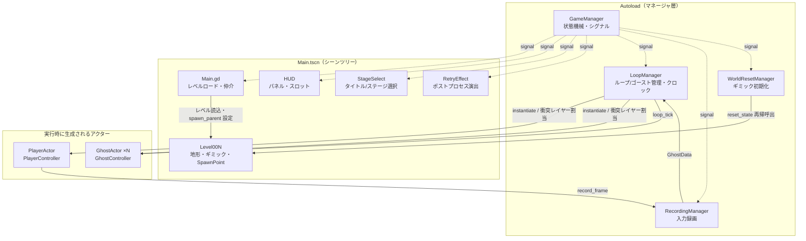
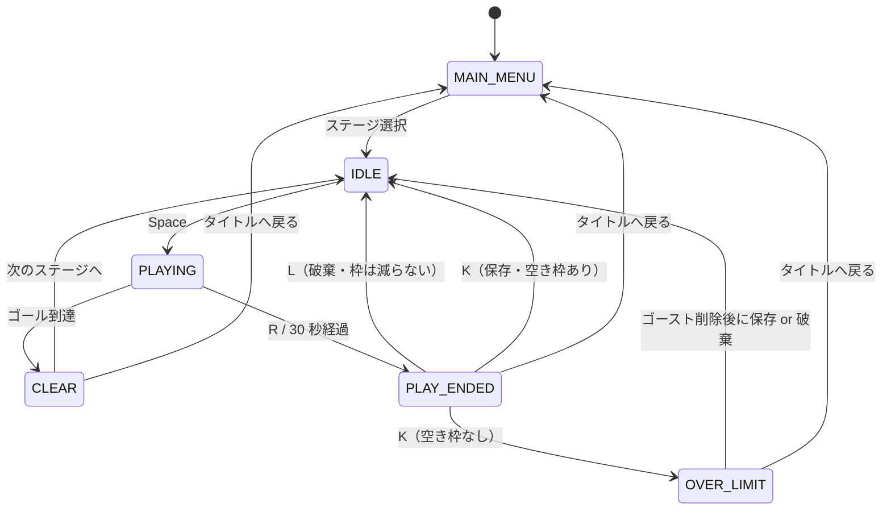

# Record ― アーキテクチャ

本書は **Record** の内部構造を説明する。「何を満たすか」は [requirement.md](requirement.md)、「画面に何が出て内部で何が計算されるか」の網羅的な記述は [SPEC.md](SPEC.md) を参照。

- 対象バージョン: `main` 相当（2026-09-05 時点）
- エンジン: Godot 4.6（Forward+）／ 言語: GDScript

---

## 目次

1. [設計方針](#1-設計方針)
2. [全体像](#2-全体像)
3. [ディレクトリ構成](#3-ディレクトリ構成)
4. [Autoload（マネージャ層）](#4-autoloadマネージャ層)
5. [状態機械とシグナル](#5-状態機械とシグナル)
6. [1 ループのライフサイクル](#6-1-ループのライフサイクル)
7. [録画と再生](#7-録画と再生)
8. [共通クロック](#8-共通クロック)
9. [アクター設計](#9-アクター設計)
10. [衝突レイヤー設計](#10-衝突レイヤー設計)
11. [ギミック機構](#11-ギミック機構)
12. [レベルとステージ選択](#12-レベルとステージ選択)
13. [UI 層](#13-ui-層)
14. [演出層](#14-演出層)
15. [設計判断とトレードオフ](#15-設計判断とトレードオフ)
16. [既知の制約](#16-既知の制約)

---

## 1. 設計方針

| 方針 | 具体化 |
|---|---|
| **状態機械は状態遷移だけを持つ** | `GameManager` はゲームロジックを一切持たず、状態遷移とシグナル発火のみ。HUD・演出・ゴースト管理・ギミックリセットはすべて購読側として独立する |
| **プレイヤーとゴーストの挙動を原理的に一致させる** | 物理は `ActorBase` に一本化し、サブクラスは入力源だけを差し替える。移動パラメータも同一の `.tres` を共有する |
| **時間は 1 本のクロックに集約する** | ゴーストは自分の経過時間を持たず、`LoopManager.loop_tick` を索引する |
| **ギミックは継承ではなく規約で繋ぐ** | 基底クラスやインターフェースを継承させず、`has_method()` によるダックタイピングで接続する |
| **データはエディタから触れる形に置く** | 移動パラメータは `.tres`、ステージ固有値は `@export`。コードを触らずに調整できる |

---

## 2. 全体像



**シーンツリー（実行時）**

```
Main (Node2D, Main.gd)
├── Level00N (Node2D, Level.gd)        ← 実行時に add_child、常に先頭へ move_child
│   ├── Terrain (TileMapLayer)          ← 衝突レイヤー 1 = World
│   ├── SpawnPoint (Marker2D)
│   ├── Goal (Area2D)
│   ├── Node/ … (PressurePlate, Door, Platform, Lamp)
│   ├── Ladder/ … (Ladder)
│   ├── GhostActor ×N                   ← LoopManager がスポーン
│   └── PlayerActor                     ← LoopManager がスポーン
├── HUD (CanvasLayer)
│   ├── CameraFrame                     ← タイマー・REC・バッテリー・操作説明
│   ├── PlayEndedPanel / ClearPanel / IdlePanel
├── StageSelect (CanvasLayer)
└── RetryEffect (Node)
    ├── Whiteout / Noise / NoiseLong / OverLimit  （各 CanvasLayer, layer = 100）
```

---

## 3. ディレクトリ構成

```
record/
├── project.godot                  # Autoload 登録・入力マップ・表示設定
├── icon.svg                       # プレイヤー/ゴーストのプレースホルダ画像も兼ねる
├── scenes/
│   ├── Main.tscn                  # ルートシーン
│   ├── actors/                    # PlayerActor.tscn / GhostActor.tscn
│   ├── gimmicks/                  # PressurePlate, Door, Platform, Lamp, Ladder, Goal, Tutorial
│   ├── levels/                    # Level001〜004.tscn
│   ├── ui/                        # HUD.tscn, StageSelect.tscn, CameraFrame.tscn
│   └── PostProcess/               # RetryEffect.tscn（演出ノードの集約）
└── src/
    ├── scripts/
    │   ├── managers/              # GameManager, LoopManager, RecordingManager, WorldResetManager（Autoload）
    │   ├── game/                  # Main.gd（仲介）, Level.gd（ステージ設定）
    │   ├── actors/                # ActorBase / PlayerController / GhostController
    │   ├── data/                  # InputFrame, GhostData, MovementStats, CollisionLayers
    │   ├── gimmicks/              # 各ギミックのスクリプト
    │   ├── ui/                    # HUD, StageSelect, camera_frame_ui, recording_battery, rec_blink, dashed_box
    │   ├── effects/               # RetryEffect + postprocess/（PostProcess, Noise, Whiteout, TextShake）
    │   └── shaders/               # Noise.gdshader
    ├── data/                      # player_movement.tres（MovementStats）
    ├── md/                        # gimmick-guide.md / gimmick-list.md
    └── assets/                    # Brackeys' Platformer Bundle ほか
```

**規約**：スクリプトは `src/scripts/<領域>/`、シーンは `scenes/<領域>/` に置き、対になるように名前を揃える。

---

## 4. Autoload（マネージャ層）

`project.godot` に登録される 4 つ。登録順がそのまま `_physics_process` の実行順になる（[16. 既知の制約](#16-既知の制約) 参照）。

| # | Autoload | 責務 | 持たないもの |
|---|---|---|---|
| 1 | [GameManager](../record/src/scripts/managers/GameManager.gd) | `GameState` の遷移とシグナル発火。全ステージ解放フラグ、初回巻き戻しフラグ、入力ロックフラグの保持 | ゲームロジック、ノード参照 |
| 2 | [LoopManager](../record/src/scripts/managers/LoopManager.gd) | ゴースト（`GhostData`）のリスト管理、アクターのスポーン/デスポーン、衝突レイヤーの動的割当、共通クロック、制限時間の判定、保存時の枠判定 | 入力の記録 |
| 3 | [RecordingManager](../record/src/scripts/managers/RecordingManager.gd) | `PLAYING` 中の `InputFrame` 蓄積と `GhostData` の生成 | 再生、スポーン |
| 4 | [WorldResetManager](../record/src/scripts/managers/WorldResetManager.gd) | `Level` 以下を再帰走査して `reset_state()` を呼ぶ | ギミック個別の知識 |

---

## 5. 状態機械とシグナル



**`GameState`**：`MAIN_MENU` / `IDLE` / `PLAYING` / `PLAY_ENDED` / `OVER_LIMIT` / `CLEAR` / `ROOM_RETRY`
（`ROOM_RETRY` は `room_retry()` API とハンドラが実装済みだが、現状 UI からは呼ばれていない）

**シグナル一覧**

| シグナル | 発火元 | 主な購読者 |
|---|---|---|
| `state_changed(new_state: int)` | すべての遷移 | LoopManager（IDLE で再配置 / MAIN_MENU で全消去）、WorldResetManager、HUD、StageSelect、recording_battery |
| `loop_started(loop_index: int)` | `start_loop()` | LoopManager（クロック開始）、RecordingManager（録画開始）、PlayerController（tick/軌跡リセット） |
| `play_ended(reached_goal: bool)` | `end_play(false)` | RecordingManager（録画停止） |
| `cleared()` | `end_play(true)` | Main（Stage 1 なら全解放）、RecordingManager |
| `ghost_saved()` | `save_ghost()` | RetryEffect（ノイズ）、HUD、recording_battery |
| `ghost_discarded()` | `discard_ghost()` | RetryEffect（ホワイトアウト）、HUD、recording_battery |
| `over_limit()` | `trigger_over_limit()` | RetryEffect（MEMORY FULL）、HUD、recording_battery |
| `rewind_started()` | 初回保存時 | RetryEffect（長いノイズ＋入力ロック）、HUD（パネルを隠す） |
| `room_retried()` | `room_retry()` | LoopManager、WorldResetManager、Main、HUD |
| `tutorial_hint(label: String)` | Tutorial 看板 | camera_frame_ui（操作説明を追加） |
| `stages_unlocked()` | `unlock_all_stages()` | camera_frame_ui（固定表示へ切替） |
| `next_stage_requested()` / `return_to_title_requested()` | HUD ボタン | Main |

シグナルは**引数を極力持たせない**方針にしている（`ghost_saved()` はデータを運ばず、購読側が `LoopManager` を読む）。購読者ごとに必要な情報が違うため、状態はマネージャに置き、通知だけを飛ばす。

---

## 6. 1 ループのライフサイクル

```
[ステージ選択]
  Main._on_stage_selected()
    → LoopManager.ClearAll()          … ゴースト全消去
    → Main._load_level_by_index()     … Level をインスタンス化、
                                        max_ghosts / spawn_parent / SpawnPoint / Goal を配線
    → GameManager.start_game()  ─→ IDLE

[IDLE]（state_changed の購読者が順に反応）
  LoopManager      : 既存アクターを despawn → ゴースト N 体 + プレイヤーを spawn、loop_tick = 0
  WorldResetManager: Level 以下の reset_state() を再帰呼出
  HUD              : IdlePanel（Press "SPACE" to Start）を表示

[Space]  Main._unhandled_input()
  → GameManager.start_loop(current_loop_index) ─→ PLAYING
    LoopManager      : クロック開始
    RecordingManager : 録画開始
    PlayerController : _loop_tick / 軌跡をリセット

[PLAYING]（毎物理フレーム）
  LoopManager      : loop_tick++ → max_tick(1800) に達したら end_play(false)
  PlayerController : InputFrame を RecordingManager へ、4 フレームごとに座標を軌跡へ
  GhostController  : LoopManager.loop_tick で GhostData を索引して入力を再現
  Goal(Area2D)     : プレイヤー進入で end_play(true) ─→ CLEAR

[PLAY_ENDED]
  K / Yes → LoopManager.save_recording(RecordingManager.build_ghost_data())
              空き枠あり → add_ghost() → （初回のみ巻き戻し演出）→ IDLE
              空き枠なし → trigger_over_limit() ─→ OVER_LIMIT
  L / No  → GameManager.discard_ghost() ─→ IDLE（枠は減らない）
  ×ボタン → LoopManager.remove_ghost(i)（状態は変えず、その場で枠が空く）
```

**ポイント**：ワールドのリセットとアクターの配置は「Space を押した瞬間」ではなく「IDLE に入った瞬間」に走る。保存・破棄・削除を選んだその場で盤面が初期状態に戻るため、Space の後にリセットが走る違和感がない。

---

## 7. 録画と再生

**記録するのは座標ではなく入力**。これが設計全体の前提になっている。

```
[録画]
PlayerController._physics_process()
  └─ _sample_input_frame() → InputFrame(tick, move_dir, jump, interact, move_up, move_down)
       └─ RecordingManager.record_frame()  … _frames に append（PLAYING 中のみ）

[確定]
RecordingManager.build_ghost_data() → GhostData { frames: Array[InputFrame] }
  └─ LoopManager.add_ghost(data)    … ghost_index と color をここで確定

[再生]
GhostController._get_input()
  └─ GhostData.get_frame(LoopManager.loop_tick) → InputFrame
       └─ ActorBase._apply_physics()           … プレイヤーと同一の物理コード
```

| データ | 定義 | 内容 |
|---|---|---|
| [InputFrame](../record/src/scripts/data/InputFrame.gd) | `RefCounted` | 1 物理フレーム分の入力スナップショット（`tick` / `move_dir` / `jump` / `interact` / `move_up` / `move_down`） |
| [GhostData](../record/src/scripts/data/GhostData.gd) | `RefCounted` | `ghost_index` / `frames`（`Array[InputFrame]`）/ `color`。範囲外 tick には空フレームを返す |
| [MovementStats](../record/src/scripts/data/MovementStats.gd) | `Resource` | 移動パラメータ。`.tres` としてプレイヤーとゴーストで共有する |

**なぜ座標を記録しないか**：座標を記録すると、扉の開閉などワールドの状態が変わったときにゴーストが壁にめり込む。入力を記録して同じ物理で再生すれば、「録画時と違って進路が塞がれていたらぶつかって止まる」という自然な結果になる。

**なぜ挙動がずれないか**：物理は `ActorBase` の 1 か所にしかなく、移動パラメータも [player_movement.tres](../record/src/data/player_movement.tres) を両アクターが共有している。録画時と再生時で別のコード・別の値が使われる余地がない。

---

## 8. 共通クロック

```gdscript
# LoopManager
var loop_tick: int = 0
var max_tick: int:
    get: return int(time_limit_sec * Engine.physics_ticks_per_second)   # 30.0 × 60 = 1800
```

- ゴーストは**自分の経過時間を持たない**。全員が `LoopManager.loop_tick` という単一のクロックでフレームを索引する。
- 制限時間も秒ではなく tick で判定する（`loop_tick >= max_tick`）。フレームレートの揺れで録画とタイマーがずれない。
- 残り時間表示は `(max_tick - loop_tick) / physics_ticks_per_second` で秒に戻す。

---

## 9. アクター設計

```
CharacterBody2D  ← ActorBase.gd（重力・ジャンプ・加減速・はしご）
    ├── PlayerController.gd   _get_input() = キーボード
    └── GhostController.gd    _get_input() = GhostData
```

`ActorBase._physics_process()` は `PLAYING` 中のみ動き、`_get_input()` → `_apply_physics()` → `move_and_slide()` を実行する。サブクラスは **`_get_input()` を上書きして入力源を差し替えるだけ**（テンプレートメソッド）。

**物理の要点**

| 挙動 | 実装 |
|---|---|
| 接地判定 | `is_on_floor()`（Godot 標準） |
| 足場への追従 | `move_and_slide()` のムービングプラットフォーム機能に委ねる。`velocity` は常に「足場に対する相対速度」だけを表せばよく、横移動中・ジャンプ中のゴーストの上でも特別扱いが不要 |
| 横移動 | `move_toward(velocity.x, move_dir * move_speed, accel * delta)` |
| はしご | `_ladder_count > 0` の間は重力を無視し、上下入力で `climb_speed` 昇降。横移動は加減速なし。**この分岐で早期 return するため、はしご中はジャンプできない** |

**移動パラメータ**（`player_movement.tres` が `MovementStats.gd` の既定値を上書き）

| パラメータ | 値 | 備考 |
|---|---|---|
| `move_speed` | 450 px/s | `.tres` で上書き |
| `gravity` | 1700 px/s² | `.tres` で上書き |
| `jump_velocity` | -700 px/s | 既定値 |
| `climb_speed` | 200 px/s | 既定値 |
| `accel` | 2400 px/s² | 既定値 |

調整はエディタでこの 1 ファイルを触るだけで済み、プレイヤーとゴーストの両方に同時に反映される。

**`PlayerActor.tscn` と `GhostActor.tscn` の差**：衝突レイヤーの初期値、スプライトの色、そしてスクリプトのみ。`CollisionShape2D`（約 128 × 127 px）と `FloorDetector`（`ShapeCast2D`）、`movement_stats` の参照は共通。

---

## 10. 衝突レイヤー設計

| bit | 値 | 名前 | 用途 |
|---|---|---|---|
| 0 | 1 | World | 地形（TileMapLayer）・Door・Platform |
| 1 | 2 | Player | 現在操作中のプレイヤー |
| 2 | 4 | Ghost_0 | 1 本目のゴースト |
| 3 | 8 | Ghost_1 | 2 本目のゴースト |
| 4 | 16 | Ghost_2 | 3 本目のゴースト |
| 5 | 32 | Ghost_3 | 4 本目のゴースト |

定数は [CollisionLayers.gd](../record/src/scripts/data/CollisionLayers.gd)（`ALL_ACTORS = 62`）。

**割り当てルール**（`LoopManager._set_ghost_collision()` がスポーン時に動的設定）

```
プレイヤー : layer = Player,        mask = World | 全ゴースト        (= 61)
ゴースト N : layer = 1 << (N + 2),  mask = World | Ghost_0..Ghost_{N-1}
```

これで **「ゴースト N は World と自分より古いゴーストとだけ衝突する」** という一方向の関係ができる。

- プレイヤーは全ゴーストと衝突する → ゴーストの頭に乗れる。
- ゴーストのマスクにプレイヤーのビットが入らない → **後から走るプレイヤーに押されない**。
- ゴースト N は N+1 以降とも衝突しない → 各ゴーストの軌道は録画時と必ず同じになる。

`FloorDetector` にも同じマスクを設定する（`ActorBase._ready()` より後に上書きされる）。

**センサー類は別扱い**：`PressurePlate` と `Ladder` は `Area2D` で `collision_mask = 62`（= 全アクター）。剛体衝突の一方向ルールとは独立に、プレイヤーとすべてのゴーストを検出する。`Goal` と `Tutorial` は `collision_mask = 2`（プレイヤーのみ）で、ゴーストが触れても反応しない。

---

## 11. ギミック機構

ギミックには**共通の基底クラスやインターフェースを継承させない**。決まった名前のメソッドを持っているかどうかだけで接続する。

| メソッド | 呼び出し元 | タイミング |
|---|---|---|
| `reset_state()` | `WorldResetManager` | IDLE 進入時 / `room_retried` |
| `activate()` | `PressurePlate` | 重みが乗ったとき |
| `deactivate()` | `PressurePlate` | 重みが外れたとき |

```gdscript
# WorldResetManager: Level 以下を再帰走査し、持っているノードだけ呼ぶ
func _reset_recursive(node: Node) -> void:
    if node.has_method("reset_state"):
        node.reset_state()
    for child in node.get_children():
        _reset_recursive(child)

# PressurePlate: target_paths で指定されたノードを has_method 経由で叩く
for target in _targets:
    if active and target.has_method("activate"):
        target.activate()
    elif not active and target.has_method("deactivate"):
        target.deactivate()
```

新しいギミックは、必要なメソッドだけ書いてレベルに配置すれば組み込める。登録リストもマネージャ側の分岐も増えない。手順は [gimmick-guide.md](../record/src/md/gimmick-guide.md)、既存ギミックの一覧は [gimmick-list.md](../record/src/md/gimmick-list.md)。

**既存ギミックの実装**

| ギミック | 型 | 実装の要点 |
|---|---|---|
| `PressurePlate` | `Area2D` | 乗っている body の配列で管理するモーメンタリスイッチ。`target_paths`（`Array[NodePath]`）で複数ターゲットを同時に操作。押下は色と位置の Tween で表現 |
| `Door` | `AnimatableBody2D` | `activate` で `CollisionShape2D` を `set_deferred("disabled", true)` にして `visible = false`。`starts_open` で初期状態を選べる |
| `Platform` | `AnimatableBody2D` | Door と逆で `activate` により出現。`initial_state` で初期状態を選べる |
| `Lamp` | `Node2D` | `ColorRect` の色を Tween。当たり判定なし |
| `Ladder` | `Area2D` | 重ねて配置しても壊れないよう、body 側の `_ladder_count` をカウンタとして増減する |
| `Goal` | `Area2D` | スクリプトなし。`Main` が `body_entered` を `end_play(true)` に接続する |
| `Tutorial` | `Area2D` | 吹き出しを Tween 表示し、`GameManager.tutorial_hint` を発火する |

---

## 12. レベルとステージ選択

- [Level.gd](../record/src/scripts/game/Level.gd) は `@export var max_ghosts: int = 3` のみを持つ。ステージ固有の設定はここに集約する。
- [Main.gd](../record/src/scripts/game/Main.gd) の `_load_level_by_index()` が `res://scenes/levels/Level%03d.tscn` を解決し、
  1. 既存レベルを `queue_free()`
  2. 新しいレベルを `add_child()` して先頭へ `move_child()`（HUD より奥に描画するため）
  3. `LoopManager.max_ghosts` にステージ値を反映
  4. `LoopManager.set_spawn_parent()` / `WorldResetManager.set_level()` を配線
  5. `SpawnPoint`（`Marker2D`）から `base_spawn_position` を取得
  6. `Goal.body_entered` を `end_play(true)` に接続
- [StageSelect.gd](../record/src/scripts/ui/StageSelect.gd) は `DirAccess` で `scenes/levels/` を実行時に走査し、`LevelNNN.tscn` からボタンを生成する。**`Level005.tscn` を置けばコードを変えずにステージが増える。**
- ステージ解放は `GameManager.all_stages_unlocked`（Stage 1 クリアで true）。永続化しないため、再起動でリセットされる。

---

## 13. UI 層

すべて `CanvasLayer`。`GameManager.state_changed` を購読して表示/非表示を切り替えるだけで、ゲームロジックは持たない。

| ノード | スクリプト | 役割 |
|---|---|---|
| `HUD` | [HUD.gd](../record/src/scripts/ui/HUD.gd) | 状態ごとのパネル切替、録画スロットの動的生成（アイコン / 番号 / ×削除ボタン / 点線の空きスロット）、保存ボタンの有効・無効 |
| `HUD/CameraFrame` | [camera_frame_ui.gd](../record/src/scripts/ui/camera_frame_ui.gd) | 残り時間表示、チュートリアルで習得した操作説明の組み立て |
| `CameraFrame/REC` | [rec_blink.gd](../record/src/scripts/ui/rec_blink.gd) | REC 表記の点滅（親の `modulate` で丸と文字をまとめて制御） |
| `CameraFrame/RecInfo/Battery` | [recording_battery.gd](../record/src/scripts/ui/recording_battery.gd) | 残り録画回数のバッテリー描画（`_draw()`）。分母は `max_ghosts`、残量で色が変わり、0 で赤枠＋斜線 |
| （空きスロット） | [dashed_box.gd](../record/src/scripts/ui/dashed_box.gd) | 点線の角丸矩形を `_draw()` で描く汎用 Control |
| `StageSelect` | [StageSelect.gd](../record/src/scripts/ui/StageSelect.gd) | タイトル兼ステージ選択 |

**録画スロットの表示規則**：常に `max_ghosts` 個ぶんのスロットを並べ、保存済みは色付きアイコン、未使用は点線枠にする。上限が 1 のステージではスロットが 1 つしか出ないため、手数制限が視覚的に伝わる。

---

## 14. 演出層

[RetryEffect.gd](../record/src/scripts/effects/RetryEffect.gd) がハブになり、`@export` で受け取った `PostProcess` ノードをシグナルに応じて再生する。演出の差し替えは**エディタ上でノードパスを繋ぎ替えるだけ**で済む。

```
RetryEffect (Node)
├── on_save       → Noise      （0.5 秒の短いノイズ）
├── on_discard    → Whiteout   （0.06 秒で白 → 0.4 秒でフェード）
├── on_over_limit → OverLimit  （TextShake: "MEMORY FULL" ＋ 画面シェイク）
└── on_rewind     → NoiseLong  （3 秒・入力ロック・振幅フォールオフあり）
```

- [PostProcess.gd](../record/src/scripts/effects/postprocess/PostProcess.gd) が `play()` だけを持つ基底クラス（`CanvasLayer`, `layer = 100`）。
- `Noise` は同じスクリプトを `_duration` / `lock_input` / `amplitude_falloff` で短い版と長い版に作り分けている。
- `TextShake` は連打時に前回の Tween を kill してリスタートし、世代カウンタ（`_shake_id`）で古い揺れループを終了させる。`Camera2D` が無い構成のため、カメラが取れなければ `CanvasLayer.offset` にフォールバックする。

**初回保存の巻き戻し演出**：`LoopManager.save_recording()` が `GameManager.first_rewind_played` を見て、起動後最初の保存のときだけ実行する。

```gdscript
GameManager.rewind_started.emit()          # 長いノイズ + 入力ロック
await _player_instance.rewind()            # 軌跡の逆再生（Tween）
GameManager.change_state(GameState.IDLE)   # 演出が終わってから再スポーン
```

軌跡は `PlayerController` が 4 物理フレームごとに `global_position` を `_trail` へ記録したもの。1 区間の時間を `REWIND_DURATION / (点数 - 1)` で決めているため、**プレイ時間の長短にかかわらず尺は常に 3 秒**に収まる。

---

## 15. 設計判断とトレードオフ

| 判断 | 得られたもの | 引き換えに |
|---|---|---|
| 座標ではなく入力を記録する | ワールドの状態が変わってもゴーストが破綻しない。データ量も小さい | 物理の決定論に依存する。エンジンやパラメータを変えると過去の録画は再現しない（本作は録画を永続化しないため実害なし） |
| 単一クロックで全ゴーストを索引する | ループを跨いでも再生タイミングがずれない | クロックを進める Autoload とアクターの実行順に依存する（[16](#16-既知の制約) 参照） |
| 一方向の衝突レイヤー | ゴーストが押されず、軌道が必ず再現される | ゴースト同士がすり抜けて重なって見える場面がある。ゴーストは 4 体（bit 2〜5）までを想定した固定割当 |
| `move_and_slide()` の足場追従に委ねる | 速度合成の自前実装が不要。動くゴーストの上でも特別扱いなし | 挙動がエンジン実装に依存する |
| インターフェースではなくダックタイピング | ギミック追加が「メソッドを書いて置くだけ」になる | 静的な検証が効かない。メソッド名のタイプミスは実行するまで気づけない |
| `GameManager` にロジックを持たせない | 購読者を独立して追加・削除できる | 「保存を押すと何が起きるか」が複数ファイルに分散する |
| ステージ設定を `@export` に置く | エディタだけで調整が完結する | 設定項目が増えるとリソース化が必要になる |

---

## 16. 既知の制約

- **セーブがない。** ステージ解放（`all_stages_unlocked`）も初回巻き戻し（`first_rewind_played`）もメモリ上のフラグで、再起動すると初期状態に戻る。
- **ゴーストの再生は録画に対して 1 tick 先行する。** `LoopManager` は Autoload なのでアクターより先に `_physics_process` が走る。ループ開始後の最初の物理フレームでは `loop_tick` が 0 → 1 になった後にゴーストが `get_frame(1)` を読むため、`frames[0]` は再生されない。全ゴーストが同じクロックを共有するのでずれは全体で一定であり、ループを跨いでも累積しないが、厳密には録画と再生が 1 フレーム（約 16.7 ms）ずれている。
- **ゴーストは 4 体（`Ghost_0`〜`Ghost_3`）までを前提**に衝突ビットを割り当てている。5 体以上を許すステージを作る場合は `CollisionLayers` とマスク計算の見直しが必要。
- **`ROOM_RETRY` 状態は経路が残っているだけ**で、現在の UI からは到達しない。
- **`interact`（E キー）は録画に残るが消費先がない。** 掴み・投げの実装が入るまでは常に無視される。
- **キャラクターアートが未実装。** プレイヤー・ゴーストとも `icon.svg` を着色したプレースホルダ。
- **音がない。** 状態の区別はすべて視覚演出に依存している。
